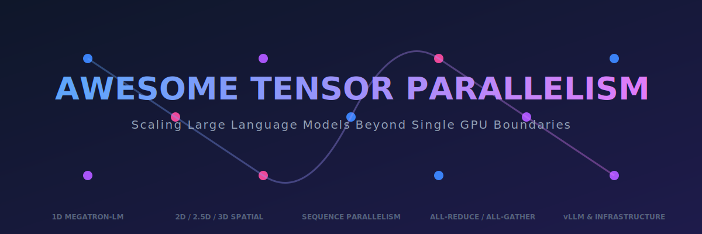
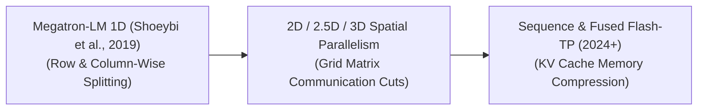

# 🚀 Awesome Tensor Parallelism

  

  

---

## 📖 Tensor Parallelism (TP): Evolution, Variants, Types, & Applications

> **SEO Description:** A curated list of resources, concepts, and architectures for Tensor Parallelism (TP) in distributed deep learning. Learn about Megatron-LM 1D, 2D/2.5D/3D grid splitting, Sequence Parallelism, and zero-redundancy optimization for training and serving multi-hundred-billion parameter LLMs.

Tensor Parallelism (TP) is a hardware-aware distributed training and inference framework designed to scale up intra-node deep learning operations. When a Large Language Model (LLM) possesses more parameters than can physically fit into the Video RAM (VRAM) of a single GPU, tensor parallelism shards individual weight matrices *within a single layer* across multiple graphics cards concurrently. Unlike Pipeline Parallelism (which distributes sequential layers across different devices), TP splits execution at the raw linear algebra level, using collective communication primitives to calculate single-matrix matrix multiplications in parallel across high-speed interconnects.

---

## 📅 1. The Chronological Evolution

The technical progression of intra-layer model parallelization has transitioned from fundamental matrix partitioning to fused multi-dimensional communication layouts.

| Strategy / Era | Core Concept | Significance / Limitation | Year First Used | First Paper Link |
| :--- | :--- | :--- | :---: | :--- |
| [**The 1D Megatron-LM Baseline Era**](./details/megatron_1d.md) | Formally established by NVIDIA. Introduced the standard Row-parallel and Column-parallel matrix cutting framework tailored explicitly for Transformer Self-Attention and Multi-Layer Perceptron (MLP) layers. | Requires two heavy communication cycles (All-Reduce / All-Gather) per transformer layer, making it highly dependent on ultra-fast hardware bridges (like NVLink). | 2019 | [Megatron-LM (Shoeybi et al., 2019)](https://arxiv.org/abs/1909.08053) |
| [**The Multi-Dimensional Spatial Grid Era**](./details/spatial_grid.md) | Expanded 1D partitioning into 2D, 2.5D, and 3D geometric grids (pioneered by frameworks like Colossal-AI). Weights are sliced along both row and column vectors concurrently across a square grid of processors. | Significantly dropped the memory footprint per GPU compared to 1D, allowing massive networks to scale across larger, non-homogeneous device grids. | 2021 | [Colossal-AI (Li et al., 2021)](https://arxiv.org/abs/2110.14883) |
| [**The Sequence-Parallel & Fused Pipeline Era**](./details/sequence_parallel_era.md) | Standard TP scales memory efficiently for model weights but duplicates activations across cards. Modern pipelines introduce Sequence Parallelism (sharding the activation tensor along its sequence length axis) and group-aware attention adaptations to compress the Key-Value (KV) cache bottleneck. | The modern state-of-the-art infrastructure baseline. | 2021 | [Sequence Parallelism (Li et al., 2021)](https://arxiv.org/abs/2105.13120) |

---

## ⚙️ 2. Core Functional & Splitting Variants

The baseline 1D Tensor Parallelism framework relies on two complementary matrix decomposition strategies deployed systematically across a Transformer's layer blocks.

| Splitting Variant | Mathematical Mechanism | Production Application | Year First Used | First Paper Link |
| :--- | :--- | :--- | :---: | :--- |
| [**Column-Parallel Linear Layers**](./details/column_parallel_linear.md) | Slices the weight matrix vertically along its column axis across $N$ GPUs: $W = [W_1, W_2, \dots, W_N]$. Given an input tensor $X$, each GPU independently computes a fractional output slice: $Y_i = X W_i$. | Used in the first linear layer of an MLP (Up-projection / Gate) and the Query, Key, and Value ($Q, K, V$) transformations in Self-Attention blocks. | 2019 | [Megatron-LM (Shoeybi et al., 2019)](https://arxiv.org/abs/1909.08053) |
| [**Row-Parallel Linear Layers**](./details/row_parallel_linear.md) | Slices the weight matrix horizontally along its row axis across $N$ GPUs. Because rows are split, the incoming input tensor $X$ must be sharded column-wise across the devices to execute valid matrix multiplication. | Used in the final output layer of an MLP (Down-projection) and the post-attention projection matrix, gathering fragments before passing parameters to the next layer block. | 2019 | [Megatron-LM (Shoeybi et al., 2019)](https://arxiv.org/abs/1909.08053) |

---

## 📡 3. Communication Operations & Latency Drivers

Because Tensor Parallelism splits individual matrix elements, the GPUs must constantly exchange tracking calculations using low-level collective communication steps.

[Column Parallel Matrix] --(All-Gather)--> [Reconstructed Hidden State] --(Row Parallel Matrix)--> [All-Reduce Collaboration]

| Communication Operation | Core Primitives | Hardware / Memory Impact | Year First Used | First Paper Link |
| :--- | :--- | :--- | :---: | :--- |
| [**All-Reduce Operations**](./details/all_reduce_ops.md) | Used at the terminal exit boundary of a Row-Parallel layer. Every GPU sums up its localized mathematical outputs with all other tracking cards in the TP group. | Highly latent; requires high-throughput bidirectional buses to prevent the GPU tensor cores from stalling while waiting for adjacent matrix values. | 2019 | [Megatron-LM (Shoeybi et al., 2019)](https://arxiv.org/abs/1909.08053) |
| [**All-Gather Operations**](./details/all_gather_ops.md) | Collects disjointed parameters distributed across different devices, reconstructing a unified, global activation matrix array across all cards before initiating subsequent linear layers. | Essential for reconstructing full activation layers before downstream computation. | 2019 | [Megatron-LM (Shoeybi et al., 2019)](https://arxiv.org/abs/1909.08053) |
| [**Sequence Parallelism Integration**](./details/sequence_parallel_integration.md) | Replaces redundant activation storage by converting All-Reduce steps into **Reduce-Scatter** operations, dispersing the sequence array across independent cards to eliminate VRAM inflation completely. | Reduces activation memory overhead, allowing for longer sequences or larger batch sizes. | 2021 | [Sequence Parallelism (Li et al., 2021)](https://arxiv.org/abs/2105.13120) |

---

## 🛠️ 4. Production Engineering Challenges & Mitigations

Deploying Tensor Parallelism across production computing infrastructure requires balancing deep algorithmic math with hardware layout physics.

| Engineering Challenge | Core Bottleneck / Problem | Mitigation Strategy | Year First Used | First Paper Link |
| :--- | :--- | :--- | :---: | :--- |
| [**The NVLink Hard Boundary Constraint**](./details/nvlink_constraint.md) | Because TP forces multiple communications *within a single layer*, executing tensor parallelism across slow network cables (like PCIe or standard InfiniBand Ethernet switches) creates massive communication lag that degrades model throughput. | Restricting the maximum Tensor Parallelism group size strictly to the number of GPUs residing inside a single physical server chassis (typically bounded to a **TP size of 4 or 8**), utilizing fast intra-node NVLink architecture exclusively. | 2019 | [Megatron-LM (Shoeybi et al., 2019)](https://arxiv.org/abs/1909.08053) |
| [**The KV Cache Memory Asymmetry**](./details/kv_cache_asymmetry.md) | When scaling models using Grouped-Query Attention (GQA), the number of Key-Value heads is significantly smaller than the number of Query heads. Slicing KV matrices evenly across a large TP group can result in fractionated heads that do not divide evenly, breaking tensor compilation shapes. | Implementing **Group-Aware TP Splitting rules**, ensuring that the TP group size scales as a clean mathematical divisor of the model's native Key-Value head counts. | 2023 | [GQA (Ainslie et al., 2023)](https://arxiv.org/abs/2305.13245) |

---

## 🌐 5. Frontier Distributed Applications

| Distributed Application | Target Scenario & Scope | Core System Configuration | Year First Used | First Paper Link |
| :--- | :--- | :--- | :---: | :--- |
| [**Pre-Training Multi-Hundred-Billion Parameter Foundations**](./details/pretraining_foundations.md) | Serves as the critical baseline infrastructure layer for elite model scaling (e.g., training Llama 3 405B or DeepSeek-V3). | TP is combined alongside **Pipeline Parallelism (PP)** and **Data Parallelism (ZeRO-3)** to form massive 3D parallel clusters. | 2020 | [GPT-3 (Brown et al., 2020)](https://arxiv.org/abs/2005.14165) |
| [**Low-Latency Real-Time Enterprise Inference Serving**](./details/inference_serving.md) | Deployed within orchestration engines like vLLM, TensorRT-LLM, or TGI. | Slicing a model across a TP group increases the memory bus bandwidth available to read model weights, drastically compressing **Time-to-First-Token (TTFT)** metrics for simultaneous multi-user streams. | 2023 | [vLLM (Kwon et al., 2023)](https://arxiv.org/abs/2309.06180) |
| [**Long-Context Window Autoregressive Generation**](./details/long_context_generation.md) | Processing extreme prompt context boundaries (e.g., full books or continuous software repositories). | Tensor and Sequence parallelism divide massive multi-gigabyte activation matrices across separate hardware nodes, safely preventing cluster-wide Out-Of-Memory memory crashes. | 2023 | [Ring Attention (Liu et al., 2023)](https://arxiv.org/abs/2310.01889) |

