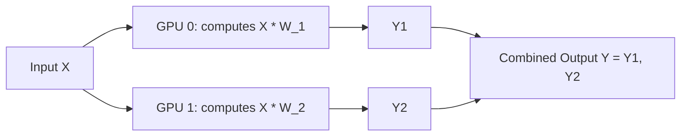

# Column-Parallel Linear Layers

Column-parallel linear layers are one of the two foundational tensor decomposition building blocks of 1D tensor parallelism. They split a linear layer's weight matrix vertically across multiple GPUs.

## Computation Flow Diagram

## How It Works

For a linear projection $Y = XW$, column-parallel splitting divides the weight matrix $W$ along its columns across $N$ devices:

$$W = [W_1, W_2, \dots, W_N]$$

Each device holds a column slice $W_i$ and computes:

$$Y_i = XW_i$$

No communication is needed during the forward pass of this layer. The final output is the concatenation of individual GPU outputs:

$$Y = [Y_1, Y_2, \dots, Y_N]$$

## Applications

* **Self-Attention Query, Key, and Value ($Q, K, V$) projections**: Splitting $Q, K, V$ projections vertically allows each GPU to naturally handle a subset of the attention heads.
* **MLP Up-projection and Gate layers**: Allows the first step of multi-layer perceptron layers to execute independently across the hardware cluster.

[← Back to README](../README.md)
