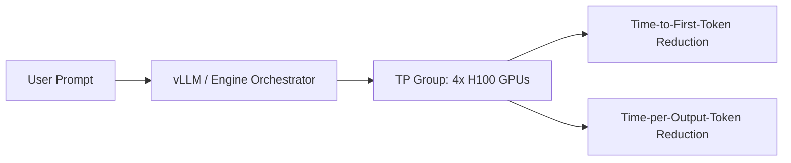

# Low-Latency Real-Time Enterprise Inference Serving

Serving Large Language Models (LLMs) in enterprise production requires highly optimized inference serving engines (like vLLM, TensorRT-LLM, or TGI). Slicing a model across a Tensor Parallel (TP) group is a standard strategy to meet low-latency serving constraints.

## Inference Pipeline Diagram

## How It Works

During inference, execution speed is memory-bandwidth bound (reading weights from GPU memory to the processors takes longer than the actual floating-point calculations).
* **Memory Bandwidth Aggregation**: Slicing the model weights across multiple GPUs (e.g. TP=4) allows the server to read the model weights from the VRAM of four cards simultaneously, multiplying the available memory bus bandwidth.
* **TTFT Reduction**: Drastically compresses the Time-to-First-Token (TTFT) when processing large incoming prompts.
* **vLLM Integration**: Deploys dynamic memory management (PagedAttention) alongside Tensor Parallelism to serve high-concurrency requests.

[← Back to README](../README.md)
