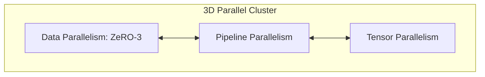

# Pre-Training Multi-Hundred-Billion Parameter Foundations

Training modern large language models (such as Llama 3 405B or DeepSeek-V3) requires scaling computation across thousands of GPUs. This is made possible by combining multiple distributed parallel strategies into a unified 3D Parallelism setup.

## 3D Parallelism Grid Diagram

## How It Works

To train a multi-hundred-billion parameter model, frameworks combine:
1. **Tensor Parallelism (TP)**: Splits individual layers within a node (typically TP size = 4 or 8) to fit large matrices into high-speed GPU memory and speed up computation.
2. **Pipeline Parallelism (PP)**: Distributes consecutive layers of the network across different nodes (typically PP size = 4 to 16) to avoid memory limitations of a single node.
3. **Data Parallelism / ZeRO**: Distributes training batches across nodes. ZeRO-3 shards optimizer states, gradients, and model parameters across the cluster to eliminate redundancy.

## Key Benefits

* **No VRAM Crashes**: Safely distributes both weights and activation calculations.
* **Optimal Throughput**: Leverages intra-node NVLink for TP and inter-node InfiniBand for PP/DP.

[← Back to README](../README.md)
