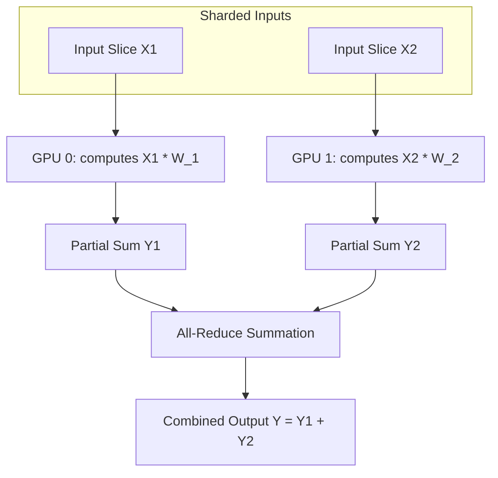

# Row-Parallel Linear Layers

Row-parallel linear layers are the second core tensor decomposition building block of 1D tensor parallelism. They split a linear layer's weight matrix horizontally across multiple devices.

## Computation Flow Diagram

## How It Works

For a linear layer $Y = XW$, row-parallel splitting divides the weight matrix $W$ along its rows across $N$ devices:

$$W = \begin{bmatrix} W_1 \\ W_2 \\ \vdots \\ W_N \end{bmatrix}$$

To perform mathematically valid matrix multiplication, the input tensor $X$ must also be split column-wise across the devices:

$$X = [X_1, X_2, \dots, X_N]$$

Each device performs local matrix multiplication:

$$Y_i = X_i W_i$$

To obtain the final correct output tensor, the partial products must be summed across all GPUs. This is achieved using an **All-Reduce** operation:

$$Y = \sum_{i=1}^N Y_i$$

## Applications

* **Self-Attention Output Projection ($O$)**: Merges heads back together and performs the final linear projection.
* **MLP Down-projection layer**: Slices down-projection weights horizontally and aggregates output shards.

[← Back to README](../README.md)
