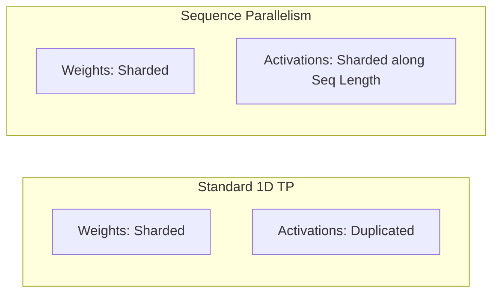

# The Sequence-Parallel & Fused Pipeline Era (~2024–Present)

As Transformer contexts expanded to hundreds of thousands of tokens, activation memory became the primary bottleneck in large-scale training. The sequence-parallel era addresses this by sharding activation tensors along the sequence dimension.

## Memory Partitioning Diagram

## How It Works

1. **Activation Splitting**: Layer normalization and dropout operations, which are normally duplicated across all GPUs in standard 1D TP, are split along the sequence dimension ($S$).
2. **Communication Fusing**: By converting standard All-Reduce operations (used at the boundary of row-parallel layers) into Reduce-Scatter and All-Gather operations, Sequence Parallelism (SP) avoids storing duplicate intermediate activations.
3. **KV Cache Compression**: Integrates with FlashAttention and Ring Attention mechanisms to shard KV-cache memory, enabling processing of extremely long sequence lengths.

## Significance

This optimization unlocks training and inference capability for long-context foundation models (e.g., Llama 3, Gemini, Claude) by eliminating redundant activation storage.

[← Back to README](../README.md)
