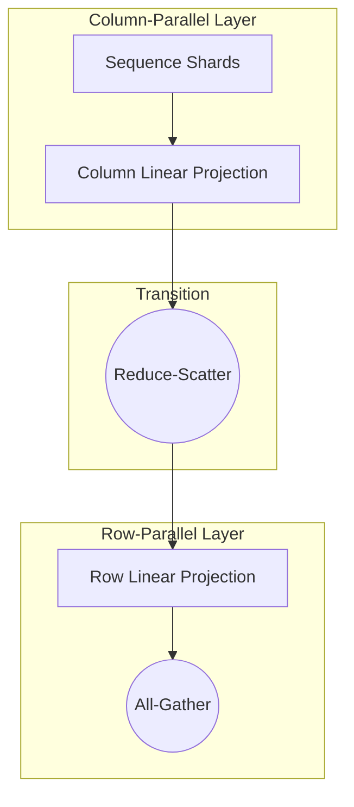

# Sequence Parallelism Integration

Sequence Parallelism (SP) integrates directly with Tensor Parallelism (TP) to split activations along the sequence length dimension. This drastically reduces the activation memory footprint, especially for long-context models.

## Integration Diagram

## How It Works

1. In standard 1D TP, non-tensor-parallel layers like `LayerNorm` and `Dropout` duplicate activations across GPUs.
2. In Sequence Parallelism, these layers are split along the sequence dimension ($S$).
3. The traditional `All-Reduce` operation at the end of a row-parallel layer is decomposed into a **Reduce-Scatter** and an **All-Gather**:
   * **Reduce-Scatter**: Reduces the results across devices and scatters them along the sequence dimension.
   * **All-Gather**: Collects the scattered sequence fragments back into a full sequence tensor when needed for downstream operations.

## Benefits

This decomposition reduces activation memory by a factor equal to the TP size, allowing models to scale to longer context sizes without executing slow host-to-device memory swapping.

[← Back to README](../README.md)
